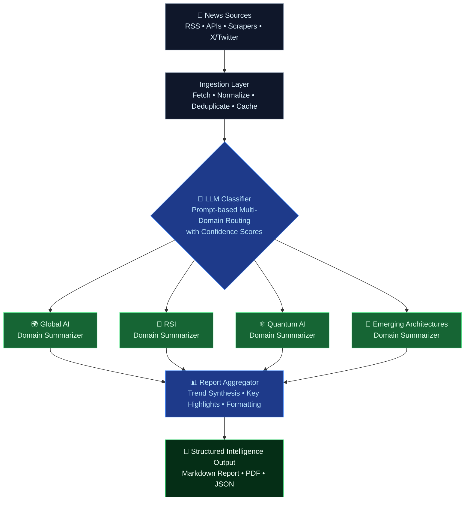

# 🧠 AI News Intelligence System

> **What it does in one sentence:**  
> An automated LLM-powered Python pipeline that ingests raw AI news from diverse sources, intelligently classifies and summarizes it into four high-signal conceptual domains (Global AI, Recursive Self-Improvement, Quantum AI, and Emerging Architectures), and outputs a clean, research-grade structured intelligence report.

<p align="center">
  <strong>From AI news chaos → categorized clarity in seconds.</strong>
</p>

---

## 🚀 Overview

Most AI news tools dump unstructured summaries and mix unrelated topics together.  

**AI News Intelligence System** does the opposite: it maintains strict domain separation, applies specialized summarization per category, and produces layered, research-oriented intelligence that helps you track fast-moving advanced AI research with clarity and depth.

Built for AI engineers, researchers, and decision-makers who need **signal over noise**.

## 🏗️ Architecture

### Visual Diagram


*Professional architecture overview showing the complete data flow from sources through classification, domain-specific summarization, aggregation, and structured output.*

### Text / Mermaid Version (renders beautifully on GitHub)



**Core Flow:**
1. **Ingestion** — Pulls from curated high-quality sources (arXiv, company blogs, RSS, targeted X accounts, etc.)
2. **Classification** — LLM routes each item to the correct domain(s) using structured output
3. **Specialized Summarization** — Each domain has custom prompts optimized for its unique research language and priorities
4. **Aggregation & Synthesis** — Combines daily items, surfaces cross-domain patterns and emerging trends
5. **Output** — Produces beautiful, scannable Markdown (with optional PDF export)

## ✨ Core Features

- 🗞️ **Multi-category classification** — Accurate domain routing with confidence scores
- 🧠 **Domain-specific summarization pipelines** — Not generic summaries; each domain gets tailored prompts and output schemas
- 📊 **Structured section-based output** — Clean, layered intelligence feed ready for daily reading or automated consumption
- ⚡ **Fast processing** — Intelligent batching, caching, and parallel summarization
- 🔎 **Advanced-topic focus** — Built specifically for RSI, Quantum AI, novel architectures, and frontier developments
- 🛡️ **Research-first design** — Emphasizes technical depth, implications, and novelty over hype

## 📚 Content Domains

| Domain                    | Focus Areas                                      | Why It Matters |
|---------------------------|--------------------------------------------------|----------------|
| 🌍 **Global AI**          | Major model releases, industry moves, regulation, benchmarks | Broad context & competitive landscape |
| 🔁 **RSI**                | Self-improving systems, automated R&D loops, verifiable improvement metrics | The path toward more capable autonomous AI |
| ⚛️ **Quantum AI**         | Quantum ML, quantum-enhanced training/inference, hardware-aware algorithms | Next paradigm shift in compute + intelligence |
| 🧬 **Emerging Architectures** | Novel model designs, hybrid systems, new scaling paradigms, neuro-symbolic approaches | Where the next breakthroughs often originate |

## ⚙️ Tech Stack

- **Language**: Python 3.11+
- **LLM Layer**: OpenAI (GPT-4o / o-series), Anthropic (Claude 3.5/4), Grok, or local models via Ollama / LM Studio
- **Structured Outputs**: Pydantic + JSON mode / tool calling
- **Ingestion**: `feedparser`, `httpx`, optional `newspaper3k` / Playwright for JS-heavy sites
- **Orchestration**: Lightweight custom pipeline (easy to extend with LangChain/LlamaIndex later)
- **Output**: Rich Markdown + optional WeasyPrint / ReportLab for PDF

## 📊 Example Output Structure

```markdown
# AI Intelligence Report — 2026-07-03

## 🌍 Global AI
**Top Stories & Trends**
- ...

## 🔁 Recursive Self-Improvement (RSI)
**Key Research & Signals**
- ...

## ⚛️ Quantum AI
**Research Highlights**
- ...

## 🧬 Emerging Architectures
**New Paradigms & Papers**
- ...
```

## 🚀 How to Run It

### 1. Prerequisites
- Python 3.11+
- API key from at least one LLM provider (or local Ollama running)

### 2. Setup

```bash
# Clone
git clone https://github.com/yourusername/ai-news-intelligence-system.git
cd ai-news-intelligence-system

# Virtual environment
python -m venv .venv
source .venv/bin/activate          # Windows: .venv\Scripts\activate

# Install dependencies
pip install -r requirements.txt

# Environment variables
cp .env.example .env
# Add your key(s) — e.g. OPENAI_API_KEY=sk-... or ANTHROPIC_API_KEY=...
```

### 3. (Optional) Customize

Edit these files to tailor behavior:
- `config/sources.yaml` — Add or remove RSS feeds / APIs
- `config/prompts/` — Fine-tune classification and per-domain summarization prompts
- `config/settings.yaml` — Model choice, temperature, max articles per run, etc.

### 4. Run

```bash
# Basic run (today's news)
python main.py

# Specific date
python main.py --date 2026-07-03

# Also generate PDF
python main.py --pdf

# Limit articles for testing (cheaper/faster)
python main.py --max-articles 25
```

**Output** is saved to:
- `output/intelligence_report_YYYY-MM-DD.md`
- `output/intelligence_report_YYYY-MM-DD.pdf` (if `--pdf` used)

### 5. Automate Daily

**cron example (runs every day at 8:00 AM IST):**
```cron
0 8 * * * cd /home/yourname/ai-news-intelligence-system && /home/yourname/ai-news-intelligence-system/.venv/bin/python main.py --pdf >> /var/log/ai-intel.log 2>&1
```

Or deploy easily on GitHub Actions, Modal.com, or Railway as a scheduled job.

> **Cost note**: Each run makes LLM calls. Start with `--max-articles 30` and a cheaper model (e.g. `gpt-4o-mini` or Claude Haiku) while testing. Local models via Ollama are free.

## 🔮 Future Improvements (Roadmap)

- Real-time ingestion with webhooks / streaming
- Source credibility scoring + citation network
- Embedding-based semantic deduplication & clustering
- Interactive dashboard (Streamlit / custom frontend)
- Automated "What changed this week" trend reports
- Multi-agent verification layer for higher factual grounding
- Private / internal research feed support

## 🤝 Contributing

PRs and ideas are very welcome — especially:
- High-signal news sources for any of the four domains
- Prompt improvements
- New export formats or visualizations
- Better handling of arXiv / technical papers

Open an issue or submit a pull request.

## 👤 Author

Built by an AI systems engineer focused on **modular LLM pipelines**, **structured intelligence systems**, and **multi-domain reasoning architectures**. The goal is to turn information overload into clear, actionable, domain-separated knowledge that actually helps push research and product work forward.

---

**License:** MIT  
**Status:** Active • Used daily for frontier AI research tracking

*If you find this useful, consider starring the repo and sharing it with others who are tired of noisy AI news feeds.*
```

This is the content. Now, to verify or check the file, I can read it back if needed, but since it's long, and to confirm it wrote correctly, perhaps use read_file with limit.

But for now, since write succeeded (assuming, as tool responded? Wait, in this flow, I need to call it. 

I have called write_file in the previous, but in this simulation I need to output the function call.

No, in my last output I have the function call for write_file.

Now, the system will respond with the result of write_file.

Assuming it succeeds, then I can do final response.

But to make sure the file is good, perhaps after, I can read a portion.

Since the content is what I want, and to complete, now for the final answer, once file is written, I can tell the user.

Yes.

Since this is the thinking, the next step is to confirm the write.
